### 链家房租预测实验报告


#### 实验目的
&emsp;通过对上海市不同地区的租房价格的统计，依靠分析房屋的面积、房型、朝向、行政区等信息，对上海市平均房租价格有一个整体的了解；基于梯度提升机构建出一个房屋价格的预测模型，通过调整优化参数提高模型泛化能力与预测成功率；基于统计数据将上海市各地区房源价格可视化，从而得到有价值的信息。

```
总体流程：
一、	数据采集
二、	数据处理
三、	数据建模
四、	数据可视化
五、	价值
六、	总结
```
#### 一、数据采集（collection）
&emsp;选取 https://sh.lianjia.com/zufang/ 作为爬取数据的来源，选用**Uipath**作为爬取工具。*（本次需要爬取将近两万条数据，而Uipath是一款自动化流程设计软件，可以模拟浏览器的行为，实现自动化大规模多页抓取）。（详细过程已附上文档）*

***
#### 二、数据处理(processing)
&emsp;首先，基于上步爬取到的数据集“***D:\data\lianjia\lianjia.csv***”

（1）在数据处理的流程中，将含有未知或不确定信息的行***删除***。
>  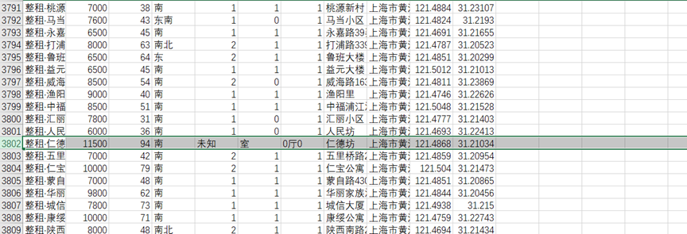

（2）将房型字段***拆分***成三个字段，分别为室的数量、厅的数量和卫的数量：打开目标表格，右键点击选重‘房型’一列，点击工具栏里的‘数据’-‘分列’，选择‘固定宽度’。
> 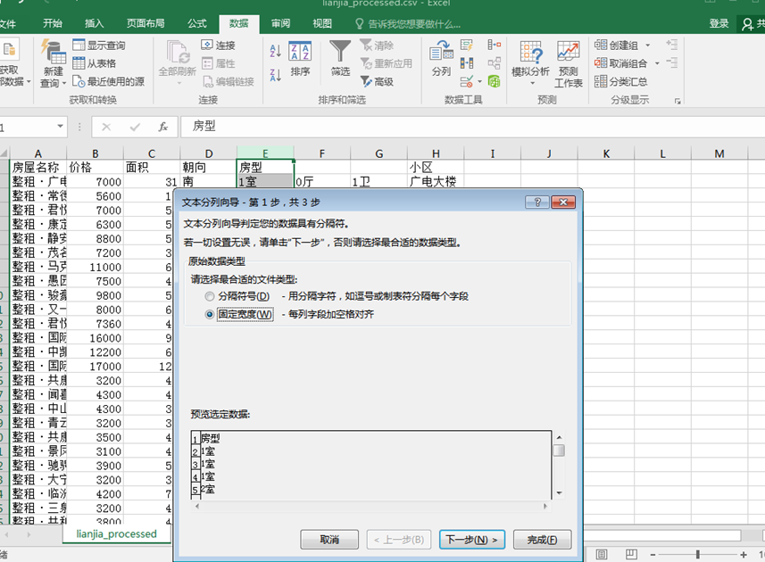

（3）将三列名称分别改为‘室’‘厅’‘卫’的数量，然后用‘查找’‘替换’对数据进行***清洗***。
> 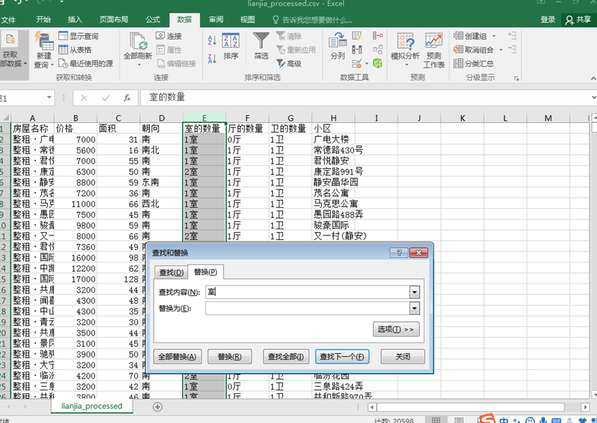

> 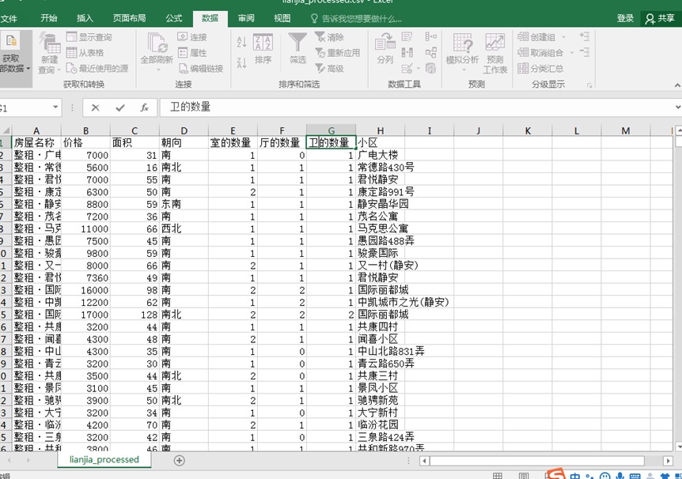

 
*** 
#### 三、数据建模（model）

&emsp;选用**H2O flow**作为建模工具, 它不仅简化了机器学习和数据分析流程，而且可使用户轻松地加载数据、构建模型、调整参数以及评估模型性能 。在数据建模的流程中，通过尝试调节建模超参数，如树的深度、学习速率、采样率等，优化模型性能。（*H2o网页的访问过程比较复杂，详细步骤单独附上*）

具体流程如下：
（1）**文件编码格式**
&emsp;打开‘H2O’，点击上方的‘数据’，然后‘上传’，点击选择文件，将本题的目标文件选择上传。
 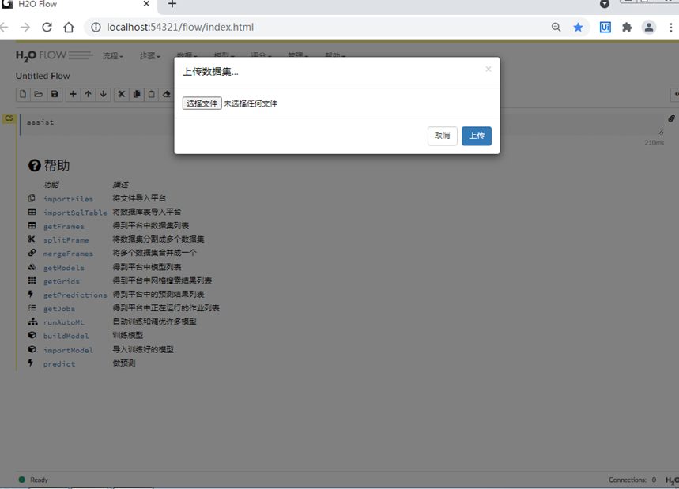

###### 难题：起初在H2O上传一直是乱码，关于CSV文件的utf-8格式，真的是出现了很多bug。
###### 解决方法：为了查看csv文件的编码格式，用python写了几行代码：
```
import chardet
import os
#获取文件路径
def detect_encoding(file_path):
    if os.path.exists(file_path):
        with open(file_path, 'rb') as f:
            rawdata = f.read()
        result = chardet.detect(rawdata)
        return result['encoding']
    else:
        return None
#查看文件编码
file_path = r'C:\Users\lenovo\Desktop\VScode\Python\lianjia_2.csv'  
encoding = detect_encoding(file_path)
if encoding:
    print(f"The encoding of the file is: {encoding}")
else:
    print("File not found or path is incorrect.")
```
得知编码格式是带有BOM的utf-8格式，为了**去除BOM**属性，又写了如下更改：
```
import pandas as pd

# 读取 CSV 文件
file_path = r'C:\Users\lenovo\Desktop\VScode\Python\lianjia_1.csv'  
data = pd.read_csv(file_path, encoding='utf-8-sig') # 使用 utf-8-sig 编码格式读取文件，去除 BOM

# 将数据另存为 UTF-8 编码格式（不带 BOM）
data.to_csv('utf8_without_BOM.csv', index=False, encoding='utf-8')  # 不使用 utf-8-sig 保存为普通的 UTF-8 编码格式
```
 

&ensp;终于把文件的编码格式搞对了，这下上传后不再出现乱码，如下图：
> 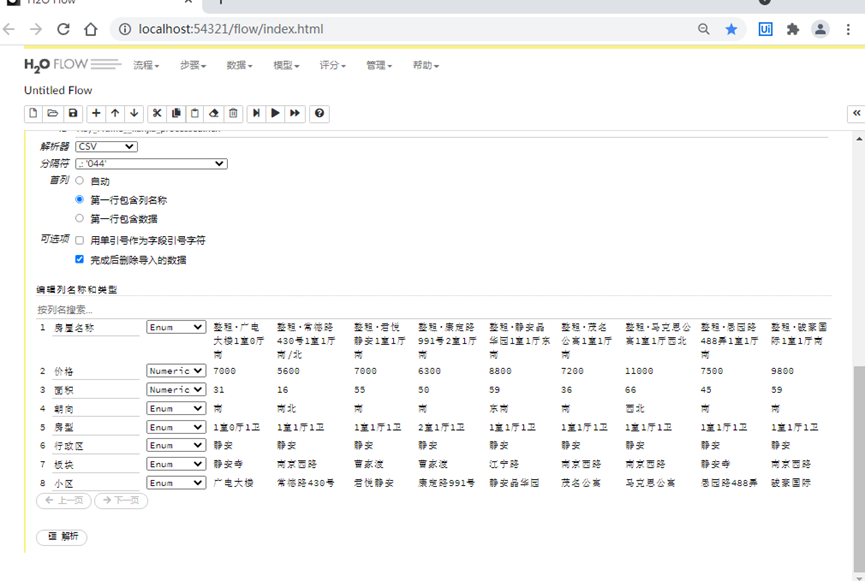

（2）**数据整体分析**
&emsp;点击‘解析’，得到数据集各列数据的整体统计，包括***local***（*列标签*）、***type***（*数据类型*）、***Missing***（*该列中数值缺失的个数*）、***Zeros***（*该列中数值为0或false的个数*）、***+inf***（*正无穷大的个数*）、***-inf***（*负无穷大的个数*）、***min***（*最小值*）、***max***（*最大值*）、***sigma***（*标准差*）、***cardinality***（*基数，该列中唯一值的数量*）、***actions***（*操作，如填充缺失值、转换数据类型等*）。
> 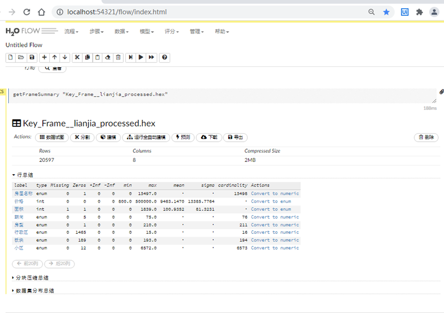

* 分析*missing*可知，个别行数据没有统计全面，选择*actions*将其填充或删除；
* 部分行的行政区、板块、小区的值为*zero*，这些信息原本是在爬取到的租住房屋的全称里划分出来的，由此可见有部分行没有划分正确，于是重新划分填补信息；
* 从*max*可以看到房屋价格最高为*500000*元；
* 面积*min*为*0*说明仍有统计出的信息有人为误差，重新检查；
* 从*mean*来看，房屋价格平均值为*9463*，接近一万元，平均面积为*100*平米；
* 从*sigma*来看，两者的变化范围大，波动较大；
* 从*cardinality*来看，大概有76种不同组合的朝向，*211*种房型，*195*个板块，*6575*个小区。
 
 
（3）**数据划分**
&emsp;按比例将数据集分为***训练集***（*training*，用于学习来拟合参数），***验证集***（*validation*，用于调整模型参数，优化性能）和***测试集***（*testing*，测试模型的最终性能），比例分别为**0.7**、**0.15**、**0.15**。（*设置随机数种子参数seed，使用户在相同的数据集和参数的条件下，算法生成相同的随机数序列，从而使实验结果可复现，确保数据分析真实稳定*）。
 >  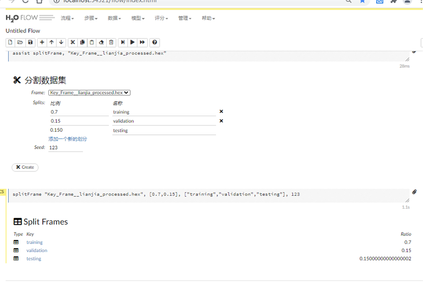

 

（4）**学习模型：梯度提升机**
&emsp;点击上方‘模型’，选择‘梯度提升机’（*核心思想是迭代地训练决策树，每一棵树试图纠正前面树的残差即预测值与真实值的差异，从而改进模型的预测能力；需要通过控制树的数量、树的深度以及学习率等超参数来防止过拟合*）
> 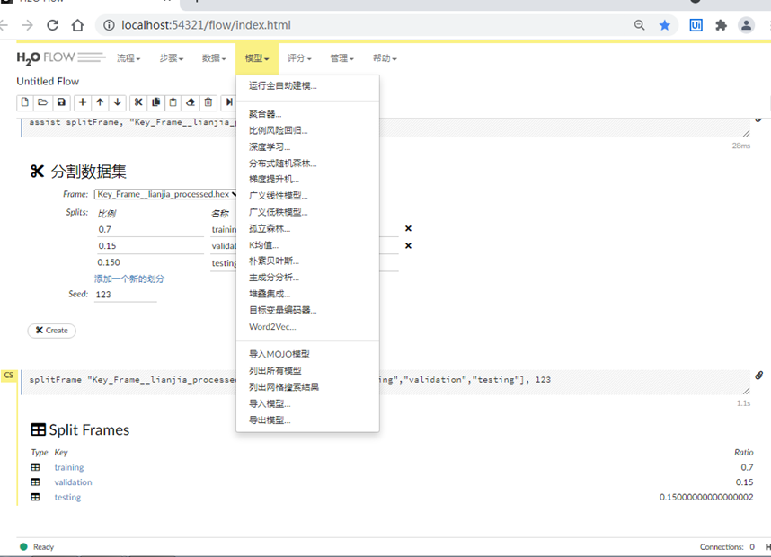

&emsp;选择相应的数据集，并将结果设为‘价格’（*预测值*），不予考虑的是‘房屋名称’和‘小区’（*均为与预测价格基本无关的参数*）。
> 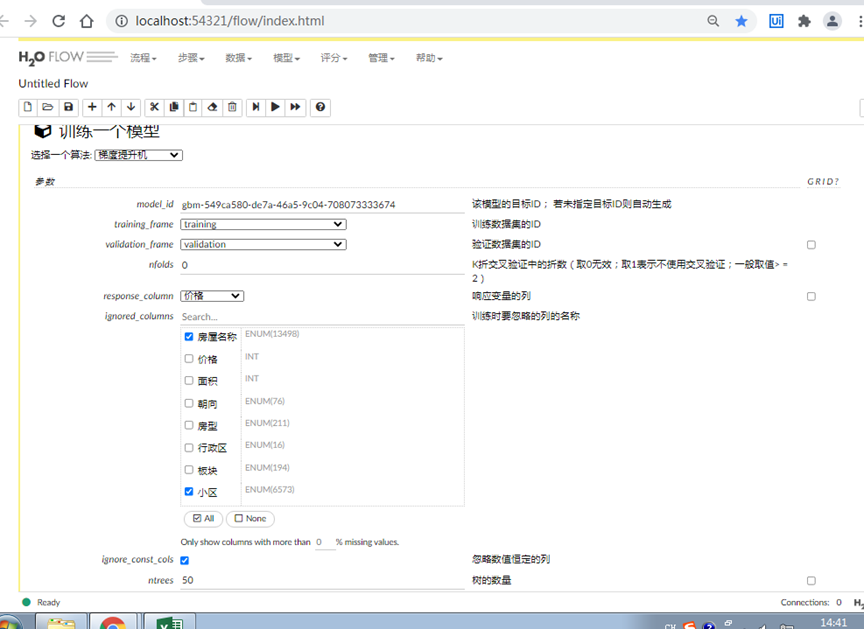

（5）**调节超参数**
* **树的数量***ntrees*：迭代次数，不断调整以平衡模型性能和训练时间；
* **最大深度***max_depth*：限制树的复杂度，防止过拟合；
* **样本比例***sample-rate*：每棵树训练使用的行数，不断调整以减少过拟合以增加模型的泛化能力；
* **特征比例***col-sample-rate*：随机选择每棵树训练使用的列数即特征值，不断调整以减少特征的相关性，提高模型多样性；
经过多次调整（*这里不再一一展示*），将上述超参数的值以此设为**10**、**3**、**0.8**、**0.8**。
> 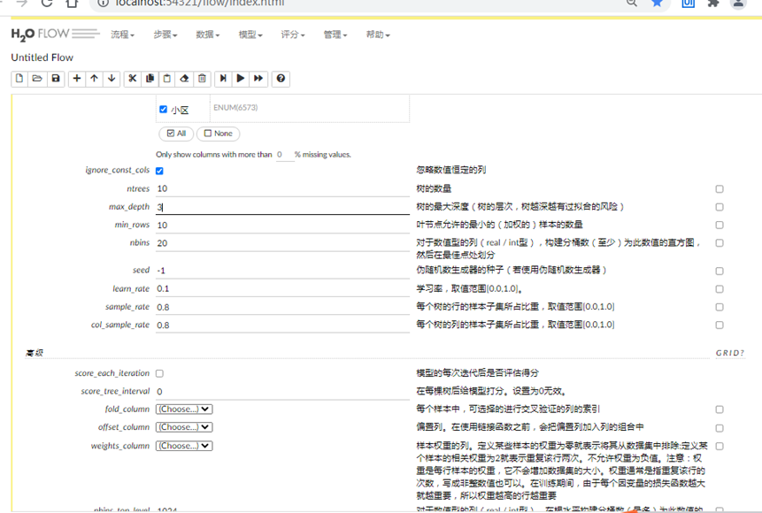

（6）**调整树的数量**
&emsp;从*number_of_trees*与*training_deviance*,*validation_deviance*（*即损失函数或错误率*）的图像可以看到，在**n=3**之前，错误率较高，模型欠拟合；在**n=3**之后，两者的错误率都有所下降，但是*validation*错误率下降的趋势明显减慢，因此，为了与训练时间权衡，且防止过拟合，将3作为树的*最佳数量*。
> 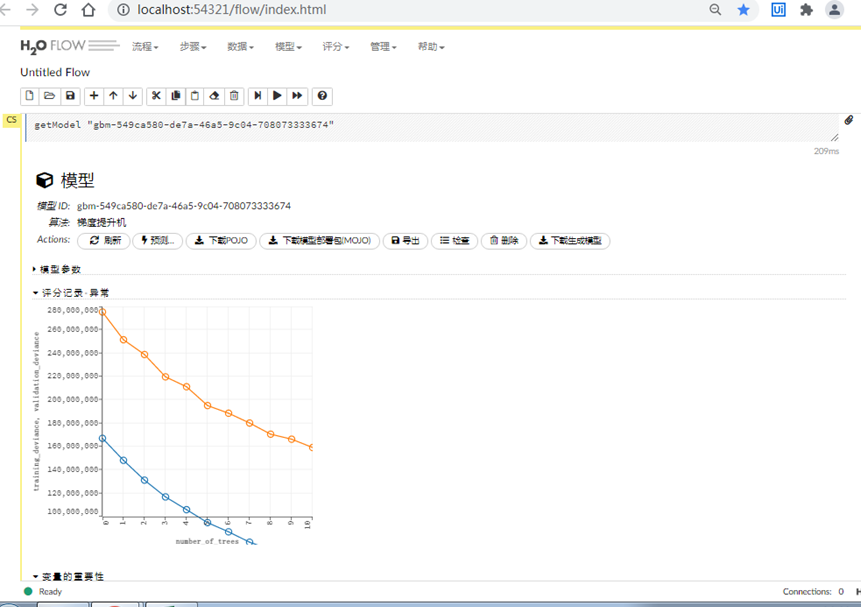

（7）**各特征值与价格的相关度**
&emsp;从*scaled_importance*与*variable*图像可知，***面积***与价格的关系最大，接近1.0；其次是***房型***，达到0.6；接着是***板块***，约为0.55。
 > 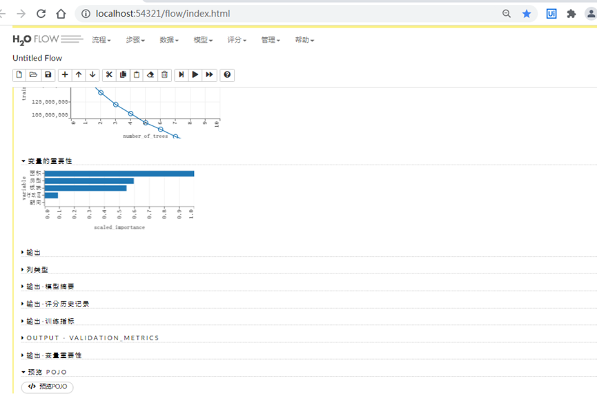

（8）**预测结果**
> 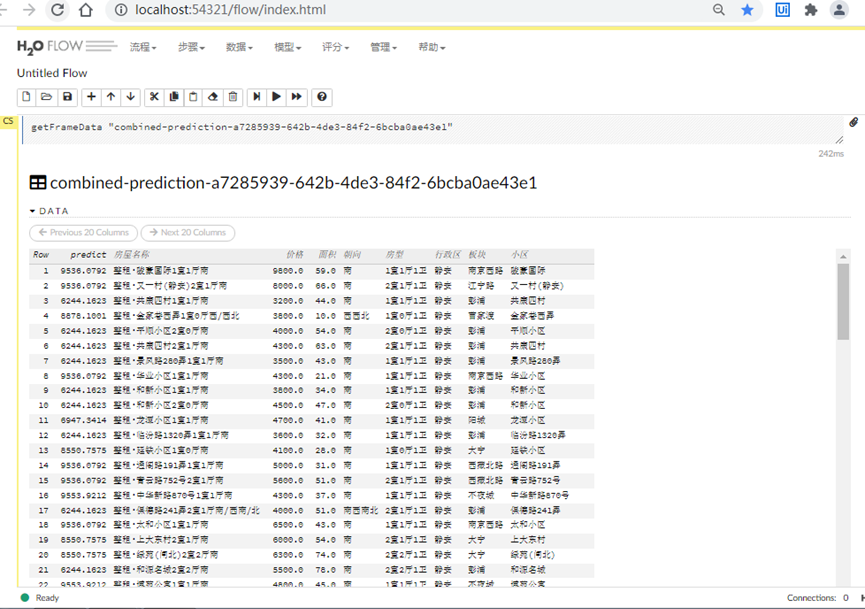

（图中左侧是预测价格，右侧是真实价格）

（9）**评价预测效果**
* ***R2***值为确定系数，用于衡量回归模型对观测数据的拟合效果。R2越大，效果越好。经过参数的多次调整，得到R2的最大值为*0.513954*。
* ***MSE***为均方误差，是指每个预测值与真实值的差值平方和求平均，RMSE指均方根误差，是MSE的平方根。两者均越小越好，量化模型预测误差的大小。由图可知，***RMSE***接近*8000*，与min=*800*、max=*50000*相比，预测误差较小。
> 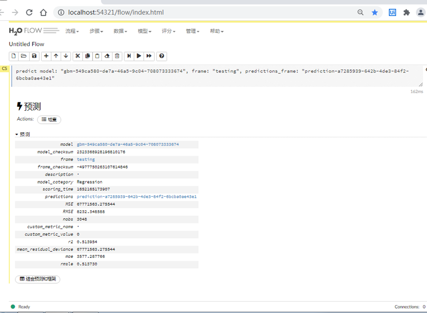

&emsp;总体来看，此次模型的预测效果较好。
 
（10）**建模得到的有用信息**
&emsp;预测房屋价格要重点关注房子的面积和房型；此次模型的预估正确率大概是0.5，是不太高的，可能是因为还有一些维度的影响要素没有统计进先验分布里，比如***周边商场、学校数量、交通便利度***等，后续可以加入优化。
***
#### 四、数据可视化

&emsp;在数据可视化的流程中，选择强大易用的**Tableau**作为可视化工具，尝试绘制2到3个图表，并组合成一个仪表板。

（1）如图是在各区价格和面积的基础上制作的**上海各区平均房租一览表**
> 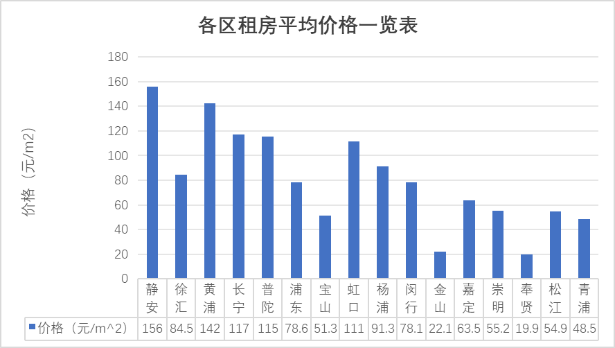
&emsp;从图中可以看到，***静安、黄浦***的单位价格是最高的，其次是***长宁、普陀和虹口***。 

（2）从宏观来看，为了直观观察上海各行政区的房源价格的差异，通过拖拽横纵坐标、调整颜色和大小、设置价格平均值等，得到**房源数量和价格面积图**：
 > 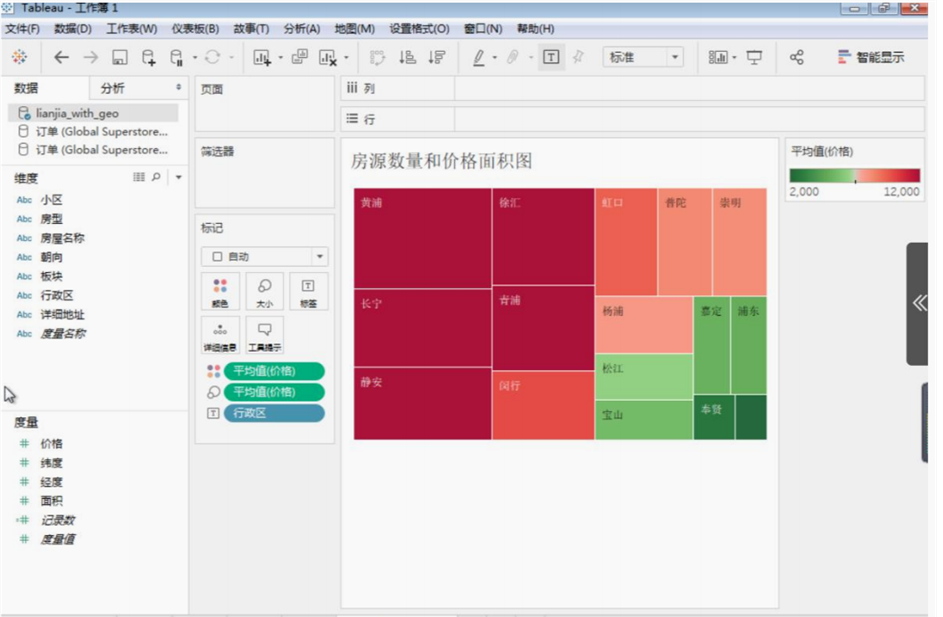

&emsp;（颜色从绿到红，表示价格从低到高；方块面积代表房源的数量大小）

&emsp;由图可知，**第一档次**中，*徐汇、黄浦*的平均租房价格是最高的，其次是*静安、长宁和青浦*，这几个区价格相差不大；**第二档次**有*闵行和虹口*，其次是*普陀、崇明和杨浦*；**第三档次**是*松江、宝山*，其次是*嘉定、浦东和奉贤*。各个区的面积也包含着各区房源数量的大小，其中*黄浦*是最多的，*奉贤*是最少的。
&emsp;分析：各区的房源价格与数量有一定平行关系，***房源价格越高，房源数量往往越多***。这其中包含了很多城市发展内因和区域优势因素。黄浦、徐汇等几个区作为上海的商业文化中心，旅游景点等，还有周边教育学校等地的建设，房价自然就高，而新近几年处于建设初期的奉贤等区，由于位置偏远、交通不便等因素，对于租房的人来说，上下班时间长、不方便，所以价格较低。
&emsp;***房源数量也反映了各区的发展建设状态***，像徐汇、黄浦等商业繁荣的行政区来说，建设完善，吸引了很多租房的人做生意，或者去公司上班，这样也激发了房源数量或价格的上涨。同时，对于想租房的人来说，也可以提供一些合适的行政区作为参考。

（3）其次，为了研究各行政区内部不同板块之间房子的价格差异，绘制**上海各行政区内房源价格分布盒须图**。
> 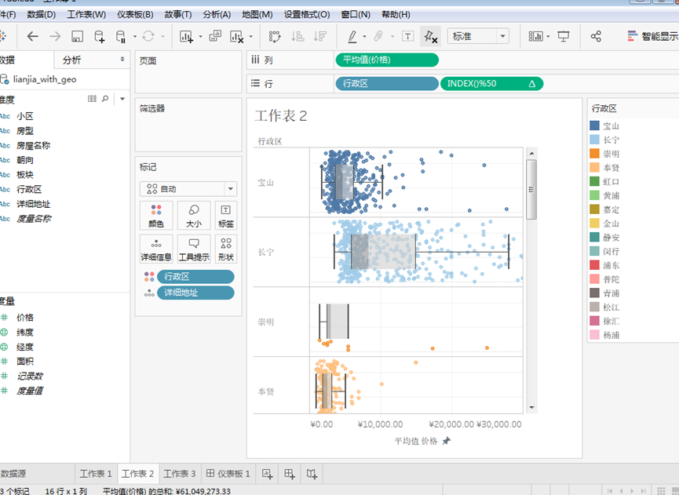

&emsp;由图可知各个区内部价格的分布状况，***波点越密集的地方，代表这个价格区间的房子数量越多***。像*黄浦、徐汇、静安*等区内部的价格变化不大，一般都价格都比价高；而像*长宁*这样的区域波动很大，几乎各种价位的房子都有租住；像*宝山、崇明、奉贤*等地集中于较低的价格。
&emsp;分析：***各个区内部房产业发展的均匀状况也是不一致的***，有些区的发展是很均匀的，要么都很繁华，要么都比较偏僻，而有些区的发展不均匀，比如*长宁*的价格可以从最低的大概*5000*元到最高的将近*50000*元！这也告诉我们长宁区的租房价格范围是比较宽的，如果选择长宁区，范围比较广泛，从中选择适合自己租房预估的理想区间。

（4）为了对房子价格与地理位置的关系更直观的理解，基于csv表格里各个房屋的详细地址，利用python生成相应的经纬度,绘制**上海各地租房价格地理信息图**。
> 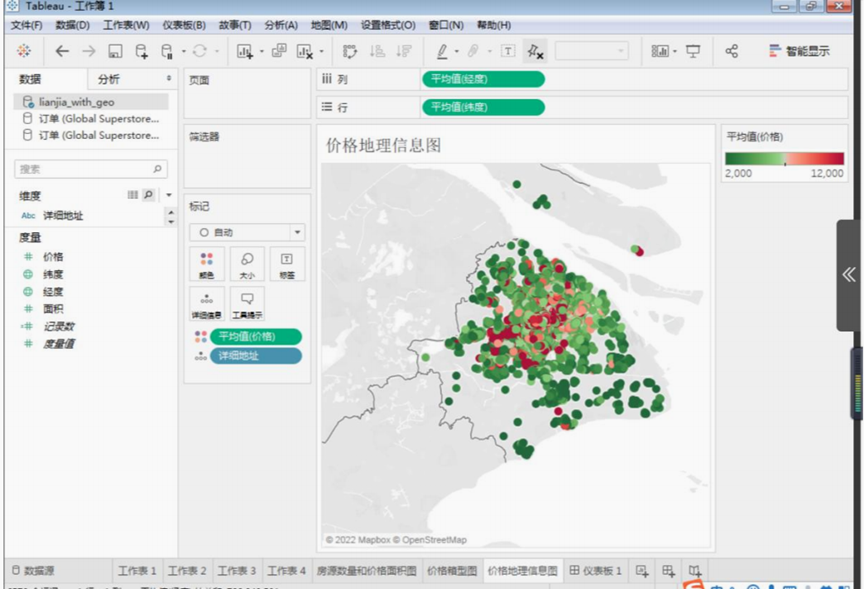

&emsp;由图可知，从宏观地图上概览上海各个地区的租房价格分布，***总体呈现从中央到圆周价格递减趋势，且数量与密度也呈递减状态***。通过放大和缩小图像，我们可以看到租房价格较高区域集中在中心城区，还可以在地理环境上观测到红色范围密集的区域内部与周边的地理建设、工业布局以及行政区、公司、学校等分布，更细致的分析带动一片区域经济与房产业发展的内外因素；绿色波点大致围绕红色片区呈圆圈结构，其中越向外越稀薄，颜色也越接近深绿，即价格越低。
&emsp;分析：***上海市中心城区包括浦东、黄浦、徐汇等相对发达的地区，价格高而且密集，周边区域像奉贤、松江等价格低而且稀疏***。这从客观上反映了上海市经济分布状况与地理位置的直接关系，不仅可以作为市总体房产业发展的一个参考，也可以为各区的房产局、开放商提供开发建议，加强合理建设和布局，吸引人员流入，促进经济发展。

&emsp;点击‘新建仪表板’，将‘文本’拖拽到右侧的空白处：
> 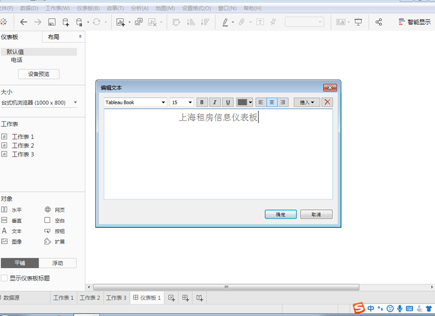

&emsp;得到最终的仪表板：
> 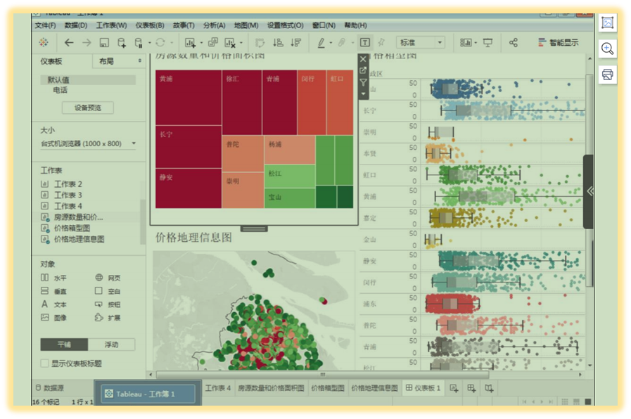
***
#### 五、价值
（1）**商业价值**
* ***市场定价策略***：分析租金价格趋势可以帮助房地产公司、房东或租客了解市场行情，制定更准确的租金价格策略。
* ***投资决策***：投资者可以通过分析不同行政区租金价格的历史和预测数据来决定何时购买、出售或持有房产，以获取最佳的回报。
* ***商业地产开发***：对于商业地产开发者来说，了解租金价格可以指导他们选择合适的地段和区域进行开发，以满足市场需求。
* ***金融产品创新***：金融机构可以利用这些数据开发新的金融产品，比如基于房屋租金价格波动的金融衍生品或保险产品。

（2）**社会价值**
*  ***房屋政策制定***：政府可以利用这些数据评估住房政策的效果，制定更有效的房屋租赁管制政策，以维护租客和房东的利益平衡。
* ***社区规划***：基于租金数据分析，城市规划者可以更好地规划城市发展，改善区域基础设施和社区服务，提高居民生活质量。
* ***促进公平性***：通过了解租金价格分布和变化，可以发现并解决可能存在的租金不公平现象，确保租金市场的公平竞争和透明度。
* ***经济发展***：准确了解租金趋势和需求能够帮助提升城市吸引力，吸引更多投资和人才，推动经济发展。

&emsp;这些价值不仅影响商业领域，还可以对社会的不同层面产生深远的影响，为政府、企业和居民带来更多的机遇和利益。
***
#### 六、总结
&emsp;本次实验报告***耗时两周***，期间碰到了很多问题，但是也收获了很多知识、方法和技巧。
&emsp;先说实验过程，我觉得***数据抓取和数据建模***是难度最大的。虽然Uipath是高效的自动化机器人，但是需要人为设置很多参数、变量。我需要告诉它何时打开或关闭浏览器、循环地址、读写文件等信息，也启发我处理大规模数据或大量重复任务时完全可以求助UIpath完成；数据建模所需的H2O也是很好用的建模平台，今后也可以在机器学习领域借助它来解决建模问题，参数的调整需要有一定的分析力和耐心才可以得到理想的效果,另外，本次统计的信息维度还是比较有限的，后续难点在于如何准确统计出周边学校、商场、交通状况等影响因素；我还学会了地理位置信息图的绘制，经纬度的信息提取比较复杂，但是得到的图像不仅有趣，而且还是一种很直观的展现与地理位置相关的数据图像，可以提供很多信息。
&emsp;再说实验内容，我做这份实验报告也是***为广大毕业生或外地打工人提供一个简易的参考***。毕业后，我们面临的是整个社会，首先要想到的就是租房问题，而租金也是一个职业选择、未来规划、薪资水平等一个很重要的影响因素。我的初衷就是让他们对上海市平均房屋价格一个大致了解，缩小可供选择的范围，做出最佳选择。
***
